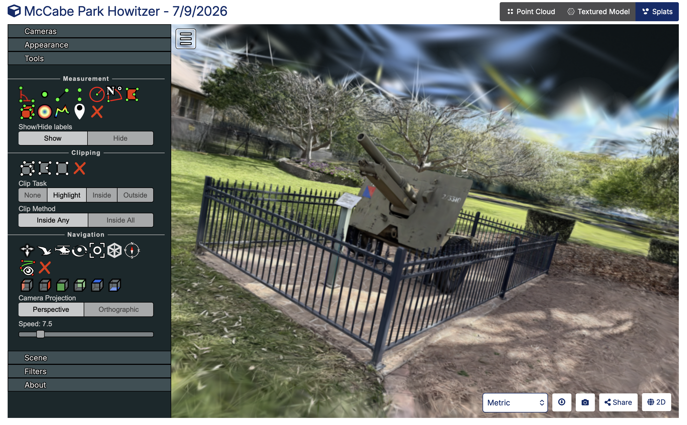
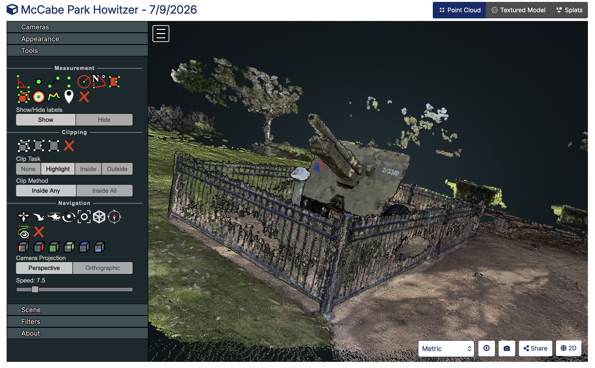
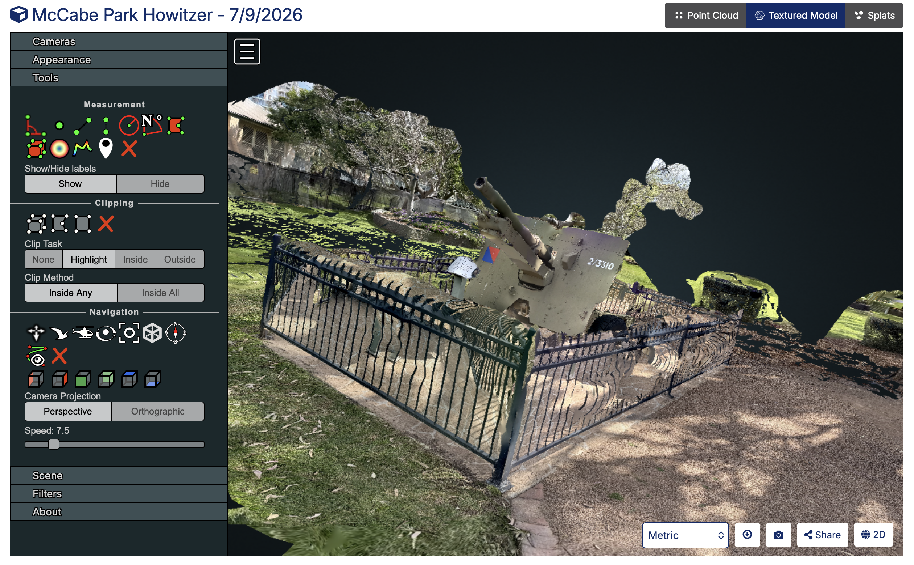
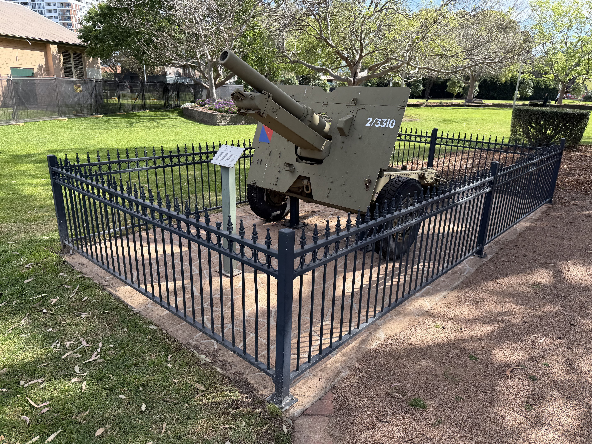

# odm_dataset_mccabe-howitzer
Sample dataset of the McCabe Park Howitzer for use in [WebODM](https://github.com/WebODM/WebODM) and [OpenSplat](https://github.com/WebODM/OpenSplat)

129 photos taken using an iPhone 17 Pro Max. None of the photos are nadir, so the data set is only useful for 3D modelling and Gaussian Splatting, not for 2D orthophotos.

Also included is the training data (camera poses and sparse points) exported from WebODM to be used directly in OpenSplat or other Gaussian Splatting software.

## Screenshots

Screenshot of Gaussian Splat processed with WebODM and OpenSplat, displayed in WebODM:

Screenshot of Point Cloud processed and displayed in WebODM:

Screenshot of Textured Model processed and displayed in WebODM:

Reference photo of the Howitzer from a similar location to the above 3D models:

